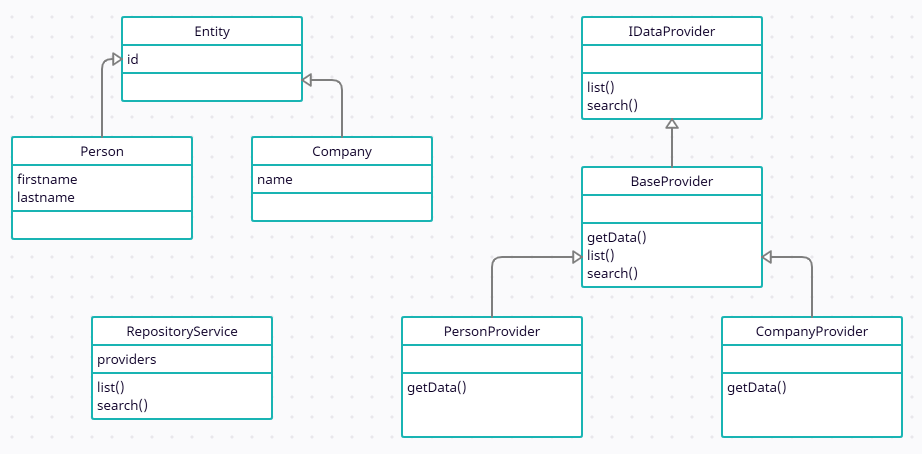

# Enonce du projet

Nous souhaitons réaliser la partie backend d'un annuaire comprenant des enregistrements de personnes et d'entreprises. Nous avons établi l'architecture objet suivante :

### 1. Architecture objet



### 2. Structure de données et valeurs de base

```js
[
    {
        id: 1,
        firstname: 'Sophie',
        lastname: 'Lozophy'
    },
    {
        id: 2,
        firstname: 'Annie',
        lastname: 'Versaire'
    },
    {
        id: 3,
        firstname: 'Paul',
        lastname: 'Ochon'
    }
];
```

```js
[
    {
        id: 1,
        name: 'Google'
    },
    {
        id: 2,
        name: 'Apple'
    },
    {
        id: 3,
        name: 'Microsoft'
    }
];
```

### 2. Création des projets et installation des modules

- En JavaScript :

```
npm init
npm install express cors
```

- En TypeScript :

```
npm init
npm install express @types/express cors @types/cors tsc
tsc --init
```